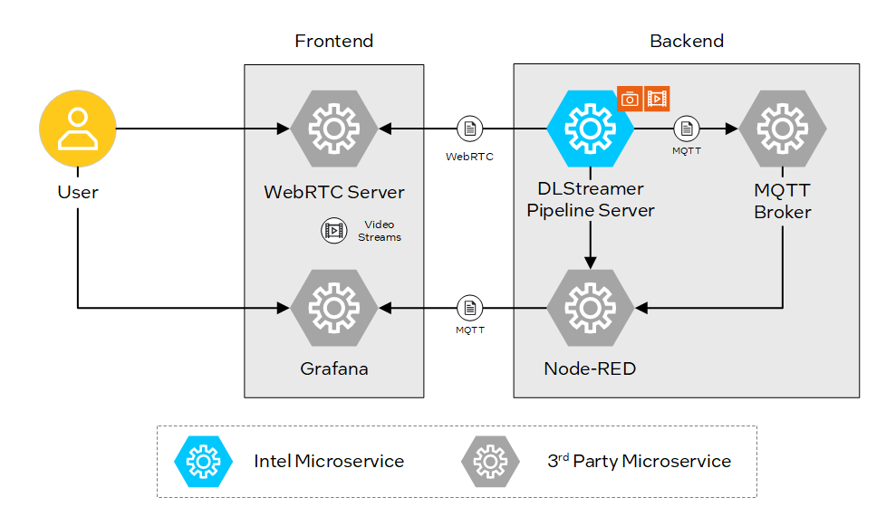

# Loitering Detection
Effortlessly monitor and manage areas with AI-driven video analytics for real-time insights and enhanced security.

## Overview

Loitering Detection leverages advanced AI algorithms to monitor and analyze real-time video feeds, identifying individuals lingering in designated areas. By proactively detecting suspicious behavior, this system helps to address potential security threats effectively.

By utilizing cutting-edge technologies and pre-trained deep learning models, this application enables real-time processing and analysis of video streams, making it an ideal solution. Its modular architecture and integration capabilities ensure that users can easily customize and extend its functionalities to meet their specific needs.

### Key Features

- **Vision Analytics Pipeline:** Detect and classify objects using pre-configured AI models. Customize parameters such as thresholds and object types without requiring additional coding.
- **Integration with MQTT, Node-RED, and Grafana:** Facilitates efficient message handling, real-time monitoring, and insightful data visualization.
- **User-Friendly:** Simplifies configuration and operation through prebuilt scripts and configuration files.

## How It Works

The architecture is designed to facilitate seamless integration and operation of various components involved in AI-driven video analytics.

### Components

- **DL Streamer Pipeline Server (VA Pipeline):** Processes video frames, extracts metadata, and integrates AI inference results.
- **Mosquitto MQTT Broker:** Facilitates message communication between components like Node-RED and DL Streamer Pipeline Server using the MQTT protocol.
- **Node-RED:** A low-code platform for setting up application-specific rules and triggering MQTT-based events.
- **WebRTC Stream Viewer:** Displays real-time video streams processed by the pipeline for end-user visualization.
- **Grafana Dashboard:** A monitoring and visualization tool for analyzing pipeline metrics, logs, and other performance data.
- **Inputs (Video Files and Cameras):** Provide raw video streams or files as input data for processing in the pipeline.

The DL Streamer Pipeline Server is a core component, designed to handle video analytics at the edge. It leverages pre-trained deep learning models to perform tasks such as object detection, classification, and tracking in real-time. The DL Streamer Pipeline Server is highly configurable, allowing users to adjust parameters like detection thresholds and object types to suit specific use cases. This flexibility ensures that users can deploy AI-driven video analytics solutions quickly and efficiently, without the need for extensive coding or deep learning expertise.

It integrates various components such as MQTT, Node-RED, and Grafana to provide a robust and flexible solution for real-time video inference pipelines. The tool is built to be user-friendly, allowing customization without the need for extensive coding knowledge. Validate your ideas by developing an end-to-end solution faster.

## Learn More
- [Get Started](./docs/user-guide/get-started.md)
